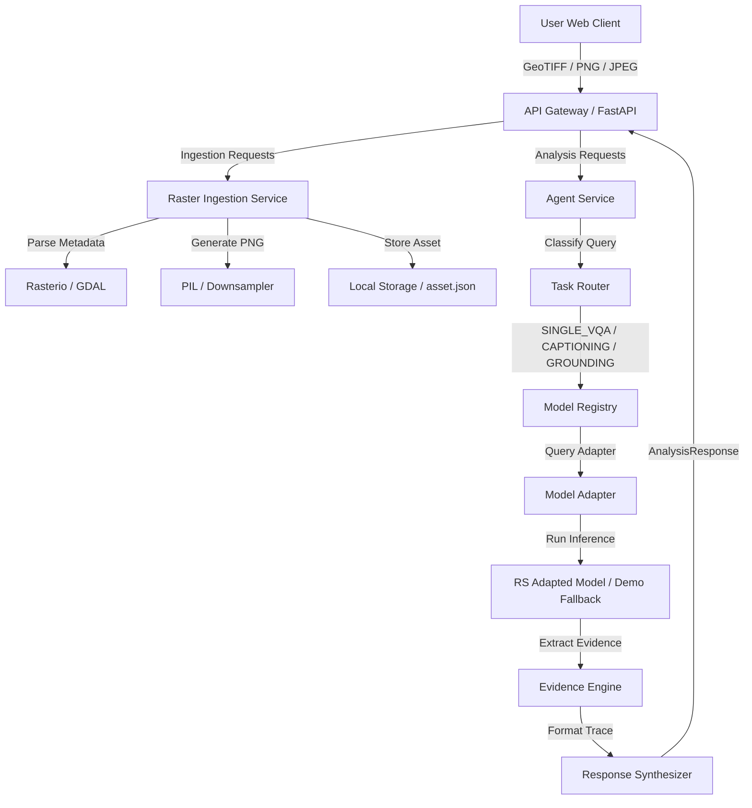

# Architecture

This document describes the architectural layout of the SatQuery AI system, outlining the GeoTIFF Ingestion Engine (Phase 2) and the Remote-Sensing VQA & Scene Captioning Engine (Phase 3).

## System Components

### 1. Ingestion Engine (Phase 1)
- **`RasterIngestionService`**: Handles receiving file uploads, storing files in unique asset folders under `data/uploads/{id}/`, and validating integrity.
- **Metadata Parser**: Uses `rasterio` to parse bounds, CRS, transform, resolution, dtype, bands, and nodata. It handles raw pixels (PNG/JPEG) without CRS by raising a warning.
- **Preview generator**: Downsamples rasters using windowed reading to conserve RAM. It maintains the original aspect ratio and outputs a PNG thumbnail to `data/thumbnails/{id}.png`.

### 2. Model Registry & Adapters (Phase 2)
- **`ModelRegistry`**: Maintains a registry of available vision models. Supports lazy loading (weights are only loaded into RAM/VRAM on first query) and CPU fallbacks.
- **Adapters**: Declares interfaces (`VQAModelAdapter`, `CaptionModelAdapter`, `GroundingModelAdapter`) that isolate specific models from the core agent router.
- **Models**:
  - `rs_vqa_adapted`: Fine-tuned on BigEarthNet spectral signatures.
  - `base_vlm`: General VLM baseline.
  - `demo_fallback`: Handles curated scenarios and provides rich grounding/captioning responses.

### 3. Agentic Routing (Phase 2)
- **Query Interpreter**: Classifies text queries into `SINGLE_VQA`, `CAPTIONING`, or `GROUNDING`.
- **Specialist Router**: Selects the best adapter from the registry.
- **Evidence Engine**: Emits an `EvidenceResult` containing spatial regions (bboxes) or text/stats, classified as `OBSERVED`, `INFERRED`, or `UNCERTAIN`.
- **Response Synthesizer**: Constructs the final payload along with a step-by-step `execution_trace` timeline.
